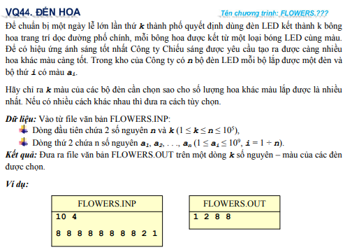
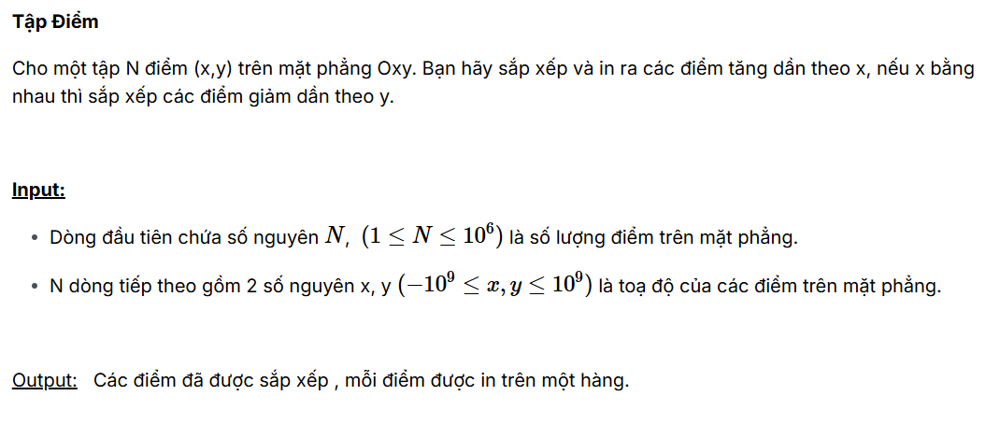

# Solution Assignment 1

Họ và tên: Hà Bùi Trọng Nghĩa<br>
MSSV: 24520020<br>
Lớp: KHTN2024

---
### VQ44_FLOWERS

Đề bài:



Ý tưởng của bài toán là duyệt qua hết tất cả các bông hoa và lưu lại những bông hoa xuất hiện đầu tiên của mỗi màu sau đó nếu còn dư slot thì thêm các bông hoa còn lại vào.

```c++
#include <bits/stdc++.h>

using namespace std;

int n, k, x;

int main()
{
    cin >> n >> k;
    vector < int > now, nope;
    map < int , int > mp;
    for (int i = 1 ; i <= n ; ++i)
    {
        int x;
        cin >> x;
        if (mp[x] != 1)
            now.push_back(x);
        else
            nope.push_back(x);
        mp[x] = 1;
    }
    for (int i = 0 ; i < min(k, (int)now.size()) ; ++i) cout << now[i] << ' ';
    for (int i = 0 ; i < k - ((int)now.size()) ; ++i) cout << nope[i] << ' ';

    return 0;
}
```

### Point2D

Đề bài:



Ý tưởng của bài toán là xử dụng compiler của hàm sort trong c++ để giải quyết.

```c++
#include <bits/stdc++.h>
#define pii pair < int , int >
#define fi first
#define se second
using namespace std;

bool cmp(pii a, pii b)
{
    if (a.fi == b.fi) return a.se > b.se;
    return a.fi < b.fi;
}
vector < pii > vi;
int32_t main()
{
    int n;
    cin >> n;
    for (int i = 1;  i <= n ; ++i)
    {
        int x, y;
        cin >> x >> y;
        vi.push_back(pii(x, y));
    }
    sort(vi.begin(), vi.end(), cmp);
    for (int i = 0 ; i < vi.size() ; ++i)
        cout << vi[i].fi << ' ' << vi[i].se << '\n';
    return 0;
}
```


