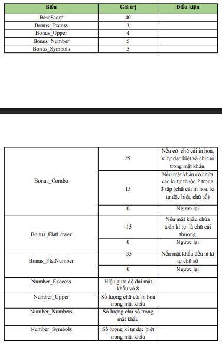

# Solution Assignment 1

### Giới  thiệu bản thân
Họ và tên: Hà Bùi Trọng Nghĩa<br>
MSSV: 24520020<br>
Lớp: KHTN2024

## Mục lục:

- [Bài 1.VQ44_FLOWERS](#bài-1vq44_flowers)

- [Bài 2.Point2D](#bài-2point2d)

- [Bài 3.VS14_Gifts](#bài-3vs14_gifts)

- [Bài 4.PasswordStrength](#bài-4passwordstrength)

- [Bài 5.CaesarCipher](#bài-5caesarcipher)

- [Bài 6.ReversingEncryption](#bài-6reversingencryption)

- [Bài 7.Messages](#bài-7messages)

- [Bài 8.Binary Search 1](#bài-8binary-search-1)

- [Bài 9.Binary Search 2](#bài-9binary-search-2)

- [Bài 10.Linear Search 1](#bài-10linear-search-1)

- [Bài 11.Linear Search 2](#bài-11linear-search-2)

- [Bài 12.Linear Search 3](#bài-12linear-search-3)

- [Bài 13.Linear Search 5](#bài-12linear-search-3)

- [Bài 14.VW05p_Enrichement](#bài-14vw05p_enrichement)

---
### Bài 1.VQ44_FLOWERS

Đề bài:


Ý tưởng của bài toán là duyệt qua hết tất cả các bông hoa và lưu lại những bông hoa xuất hiện đầu tiên của mỗi màu sau đó nếu còn dư slot thì thêm các bông hoa còn lại vào.

### Bài 2.Point2D

Đề bài:


Ý tưởng của bài toán là xử dụng compiler của hàm sort trong c++ để giải quyết.

### Bài 3.VS14_Gifts

Đề bài:


Ý tưởng thuật toán để giải quyết là sử dụng chặt nhị phân để xác định khi xét 1 phần từ thì chúng ta tìm được phần từ lớn nhất x ```(x <= tổng tiền - món quà đang xét)```. Khi đó sau khi duyệt hết lấy tổng giá trị lớn nhất ra được kết quả bài toàn.

### Bài 4.PasswordStrength

Đề bài của bài này khá dài nhưng tóm tắt được như sau:

- Cho công thức tính độ mạnh của mật khẩu.
- cho các giá trị, tính các giá trị và chèn vô công thức tính độ mạnh của xâu đề bài đưa ra.

Các giá trị được tính như sau: 


Công thức cuối cùng:


Với bài này chỉ việc tính theo yêu cầu và chèn vào công thức tính kết quả cuối.

### Bài 5.CaesarCipher

Đề bài:


Ý tưởng bài toán làm theo đề bài sử dụng kết hợp với mod để tính ra giá trị cần thiết.

### Bài 6.ReversingEncryption

Đề bài:


Với bài toán chỉ cần decode theo quy tắc đề bài đặt ra như sau:
- duyệt trên các ước của n theo thứ tự từ 1 đến n.
- với mỗi ước số d, đảo ngược chuỗi con [1...d].

Sau khi hoàn thành thi hoàn tất quá trình decode lại chuỗi.

### Bài 7.Messages

Đề bài:


Với ý tưởng thuật toán như sau:
- duyệt chuỗi Sb từ cuối đến đầu cùng với chuỗi Se từ đầu tới cuối sẽ được vị trí i.
- tìm độ i lớn nhất sao cho Sb từ cuối - i đến cuối bằng với Se từ đầu đến đầu + i.

### Bài 8.Binary Search 1

Đề bài:


Ý tưởng thuật toán là duyệt theo phương pháp chặt nhị phân tìm theo yêu cầu đề bài.

### Bài 9.Binary Search 2

Đề bài:


Ý tưởng bài toán giống bài trên nhưng thay đổi dữ liệu thành dạng string cho phù hợp với đề bài.

### Bài 10.Linear Search 1

Đề bài:


Đề bài trên chỉ yêu cầu duyệt trên dãy số và thao tác.

### Bài 11.Linear Search 2

Đề bài:


Theo tác bài dưới giống bài trên chỉ cần tinh chỉnh 1 xíu.

### Bài 12.Linear Search 3

Đề bài:


ý tưởng thuật toán là với mỗi phần tử sẽ lưu lại và duyệt số mex cho đến khi số mex đã thành số mex.

### Bài 13.Linear Search 5

Đề bài:


Với bài toán trên chỉ việc sắp xếp lại 1 đoạn là phần từ lớn nhất và bé nhất phần còn lại là đoạn giữa sẽ luôn cho ra kết quả lớn nhất.

### Bài 14.VW05p_Enrichement

Đề bài:


duyệt qua hết tất cả các ô và các ố 3x3 xung quanh tìm min của tổng ô 3x3 xung quanh.


