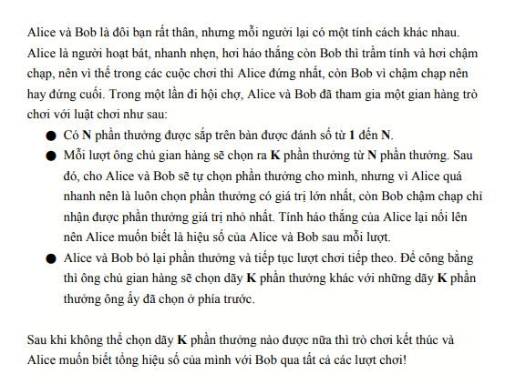
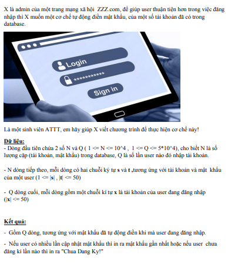
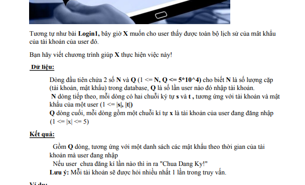
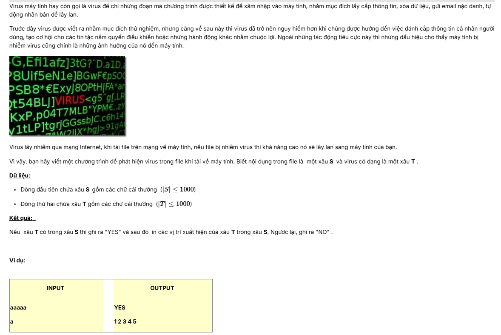
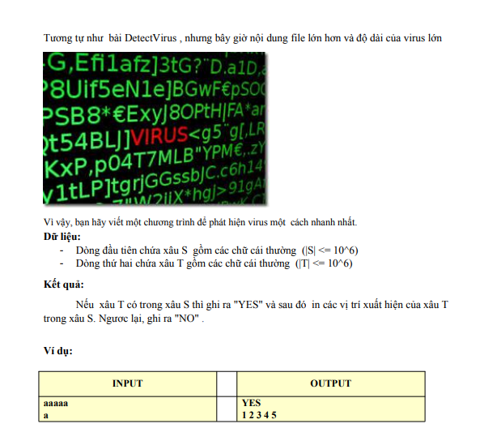
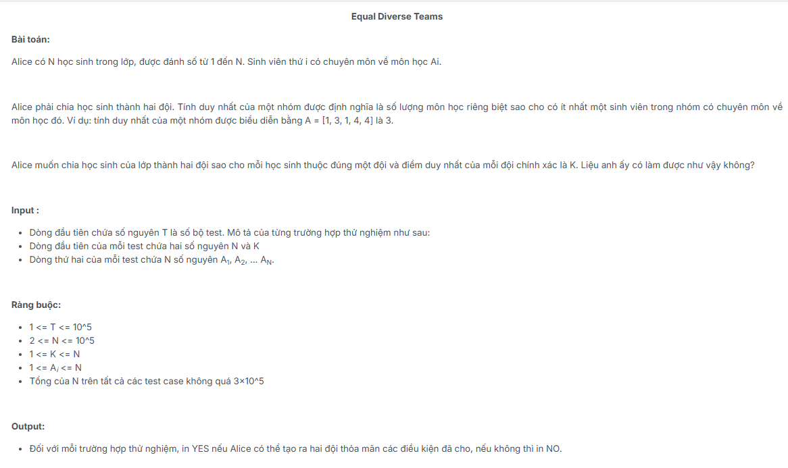
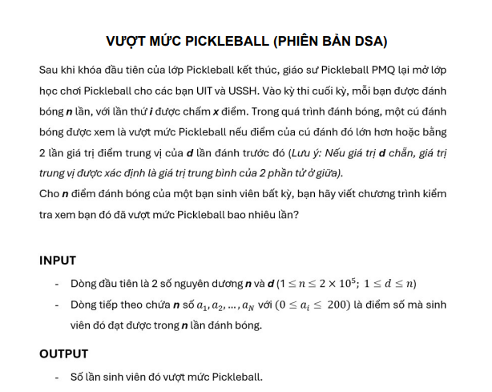
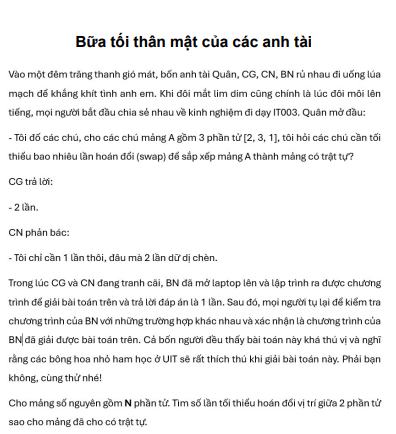
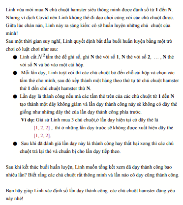

# Assigment2 (Advance)

### Giới  thiệu bản thân
Họ và tên: Hà Bùi Trọng Nghĩa<br>
MSSV: 24520020<br>
Lớp: KHTN2024

## MaxMinSum



Bài toán yêu câu tính hiệu số lớn nhất của dãy con dài k và số nhỏ nhất của đoạn con đó:
- Bài toán trên đâu tiên biết được tính chất:
    - với số lớn nhất đãy thì có (n - k)C(k - 1) dãy.
    - số lớn nhì (n - k - 1)C(k - 1)
    - ...
- Như vậy suy ra được công thức và tính sẽ ra kết quả cuối cùng phân số nhỏ nhất cũng làm như vậy. Kết quả là hiệu của chuỗi tổng tìm được và chuỗi hiêu tìm được.

## khangtd.Login1



Chỉ cần dùng map ```<string,string >``` lưu trữ tài khoản và mật khẩu, sau đó in ra kết quả theo đề bài.

## khangtd.Login2



Bài toán là bản nâng cấp của bài toán 1, lần này chỉ cần lưu mật khẩu vào vector của chuỗi tài khoản và in ra theo đề bài.

## 	khangtd.DetectVirus



Chúng ta dùng cửa sổ trượt.

## khangtd.DetectVirus2



Chúng ta dùng KMPZ để giải bài toán.

## Linear Search 4



Chỉ cân xếp các số duy nhất trước sau đó xếp các phần còn lại.

## Vượt mức Pickleball v2 (time limit: 0.5s)



Chỉ cần quan sát giới hạn số là 200 và theo tác trên đó.

## 	Bốn ông điên



Bài toán trên giải quyết bằng cách đếm số chu kỳ của đồ thị. Đồ thị được tạo ra bằng cách nối vị trí số hiện tại đến với vị trị đúng của nó.

## Huấn luyện chuột



Bài này được công thức ```(n*2-1)Cn```. Dùng lucas theory để giải.


