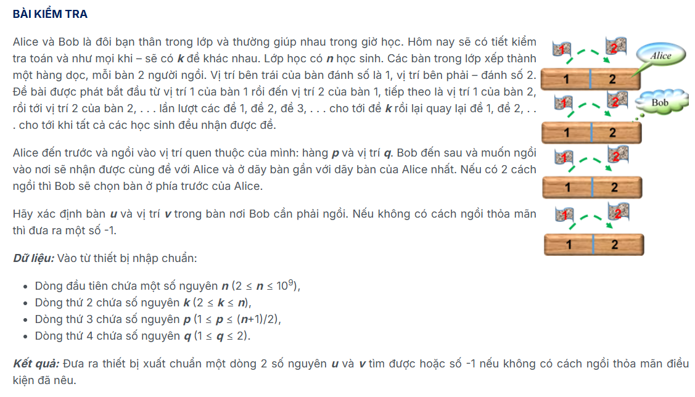
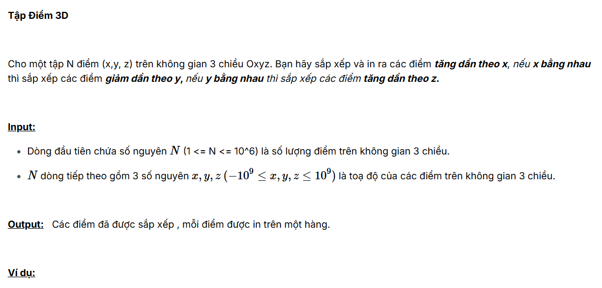
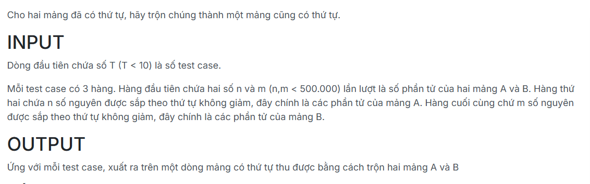
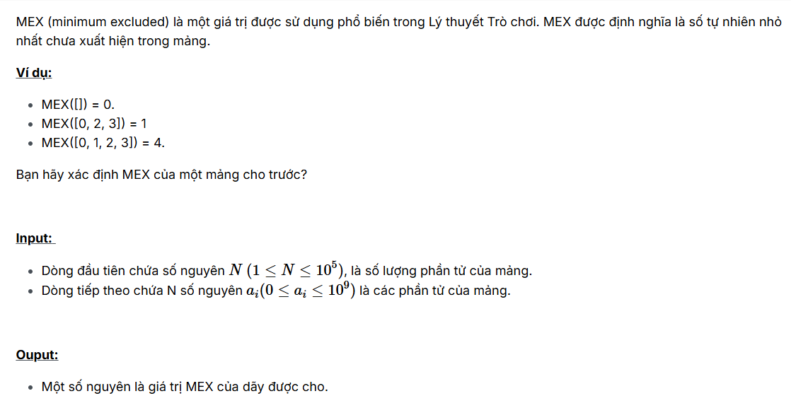
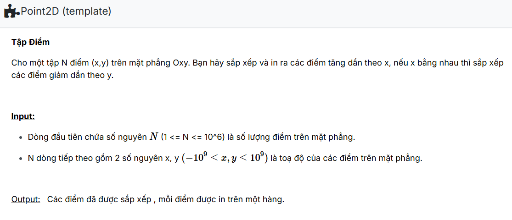
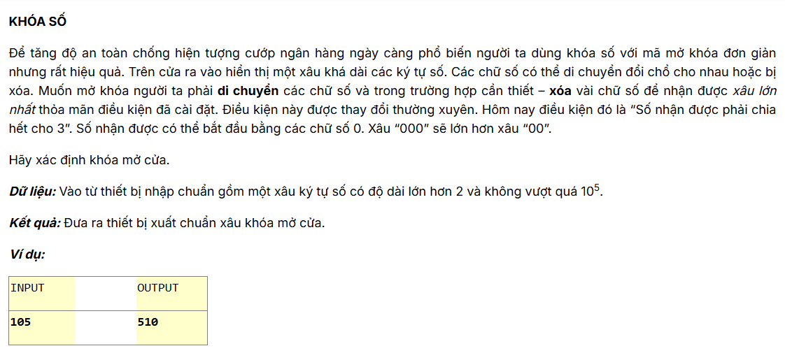
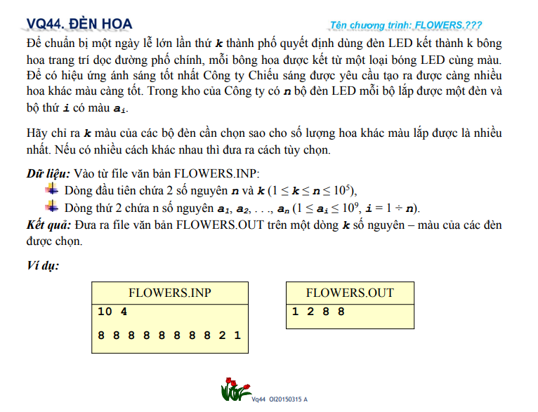
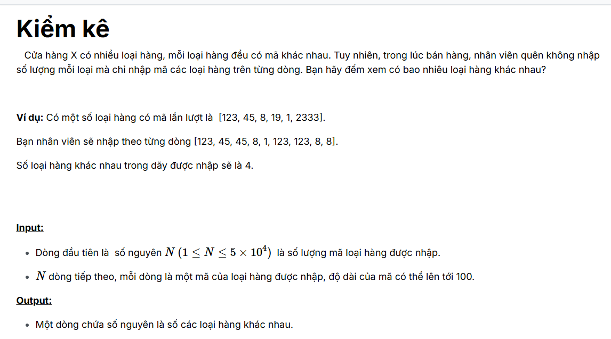

# Assignment 2 (Basic)

## Bài 1. 	Task

Đề bài:

Ý tưởng của bài toán là xếp các học sinh lại thành 1 hàng thẳng, sau đó kiểm tra vị trí của học sinh phía trước và phía sau.

## Bài 2. Point3D

Đề bài:

Bài toán này cấm dùng các hàm như sau:

Vì vậy code Quick Sort và điều chỉnh compile là hoàn thành bài toán.

## Bài 3. an.512.Trộn 2 mảng

Đề bài:

Bài toán trộn với thao tác tuần tự và mảng mới.

## Bài 4. Find MEX

Đề bài:

Bài toán yêu cầu tìm mex của dãy số khi không sử dụng những thứ sau:

Khi này sẽ sort lại bằng Quick Sort, sau đó duyệt tuần tự tìm MEX của dãy số.

## Bài 5. Point2D (template)

Đề bài:

Bài toán không cho sài những hàm sort có sẵn nên sẽ sử dụng Quick Sort tự code.

## Bài 6. VU33_MaxStr

Đề bài:

Với bài toán trên sẽ có 2 trường hợp cần giải quyết:
- Tổng dãy số (MOD 3) dư 1, có 2 cách lấy:
    - Lấy 1 số dư 1 nhỏ nhất.
    - Lấy 1 số dư 2 và dư 1 nhỏ nhất.    
- Tổng dãy số (MOD 3) dư 2, cũng có 2 cách lấy:
    - Lấy 1 số dư 2 nhỏ nhất.
    - Lấy 1 số dư 1 và dư 2 nhỏ nhất.
Giải quyết bài toán với tính chất trên.

## Bài 7. VQ44_FLOWERS(template)

Đề bài:

Bài toán trên không có phép dùng những công cụ sau:

Chỉ cần sử dụng Quick Sort code lại và duyệt những phần tử đầu tiên xuất hiện sau đó xuất các phần từ còn lại.

## Bài 8. Kiểm kê 

Đề bài:

Bài toán này không cho phép sài những thứ sau:

Vì vậy chỉ cần Sort và lấy phần tử đầu tiên.

## Bài 9 - 10. MergeSort - InsertionSort - BubbleSort - SelectionSort

Dạng bài này chỉ cần in theo yêu cầu đề bài.
