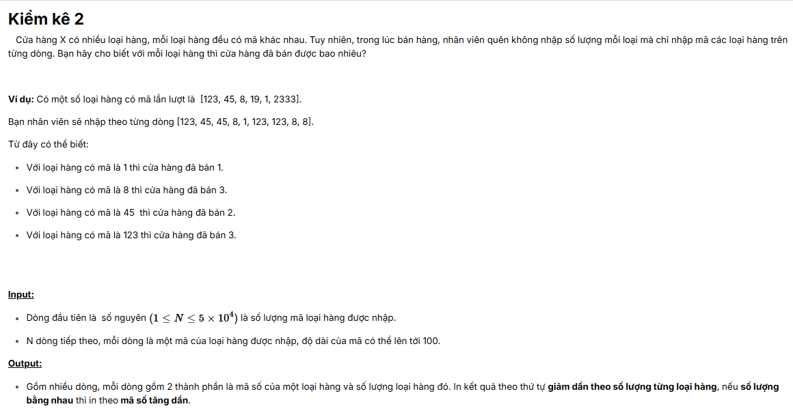
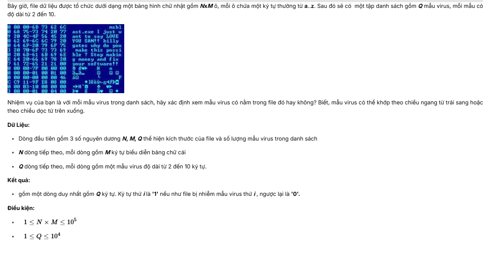
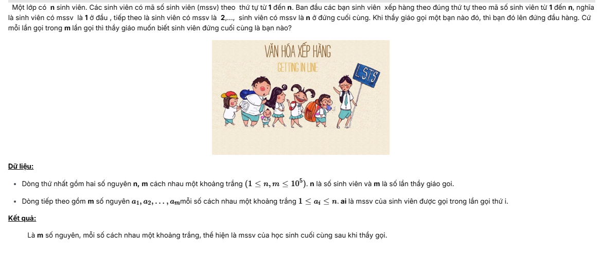

# Assignment 3 Advance

### by Nart2 - Hà Bùi Trọng Nghĩa KHTN2024 24520020

## 	Kiểm Kê 2

Đề bài:

Chỉ cần code phần sort lại là giải quyết thành công bài toán.

## Binary Search 2

Đề bài:

Chỉ cần code sort lưu lại vị trí và duyệt theo giá trị, sau đó dùng chặt nhị phân để giải quyết bài toán.

## khangtd.DetectVirusin2D

Đề bài:

Dùng cấu trúc dữ liệu tries để giải quyết bài toán.

## khangtd.XepHang2

Đề bài:

Dùng Link list Duo để lưu lại phần cuối và cập nhập vào đâu khi thay đổi.

## khangtd.XepHang

Bài toán giống y trên chỉ việc in ra vào đoạn cuối của chương trình.
