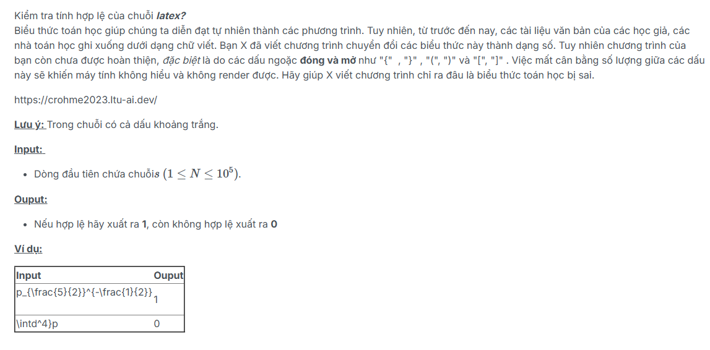
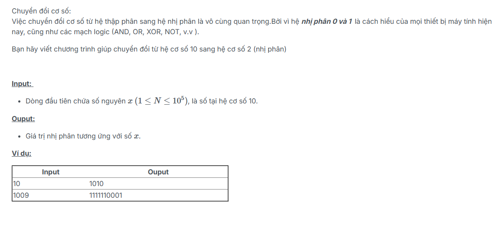
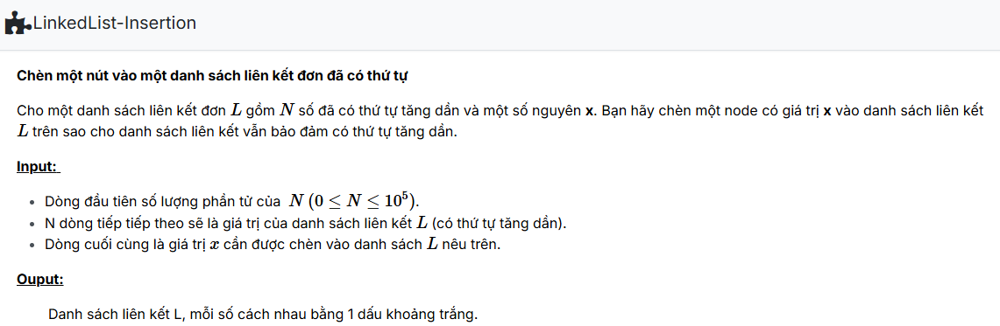
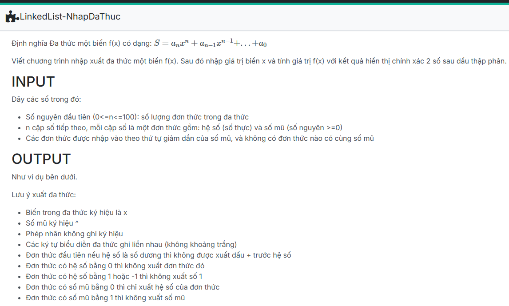
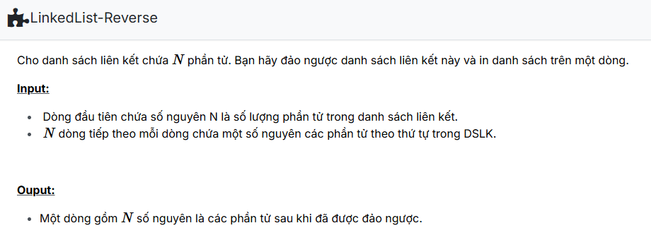
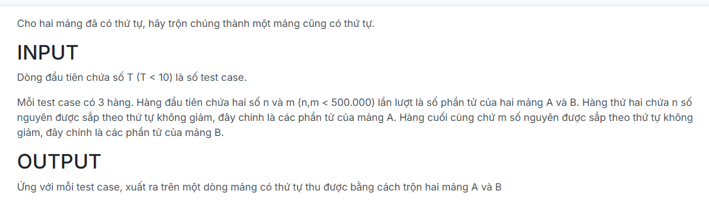
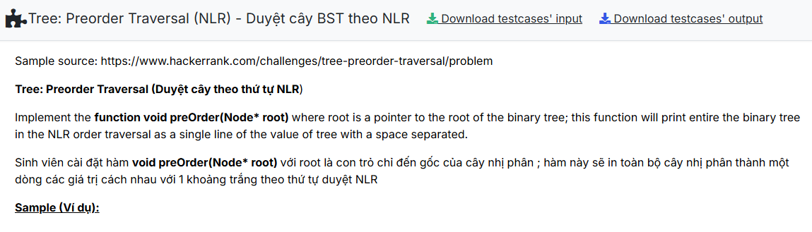
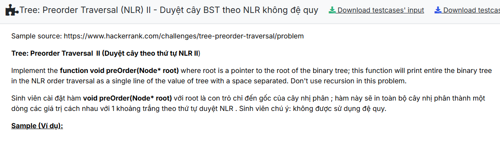
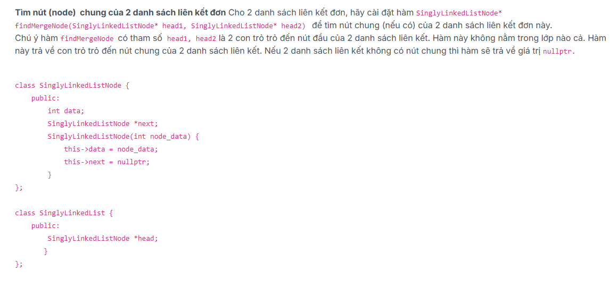
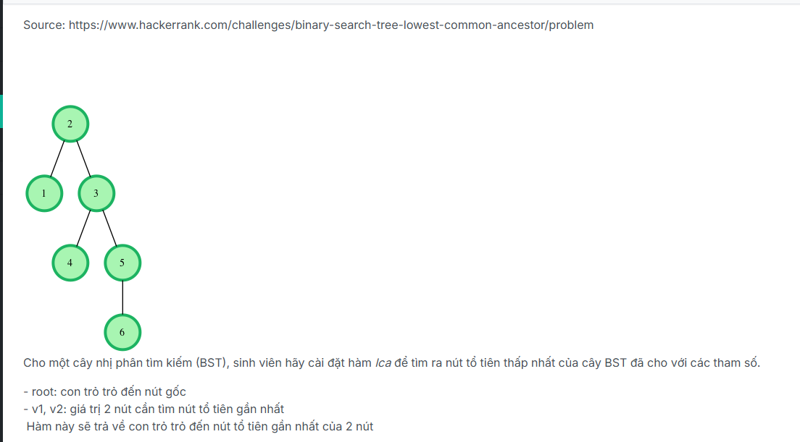

# ASSIGNment 3 basic

## by Nart2

### Kiểm tra biểu thức toán học (Latex)

Đề bài: 

Chỉ cần sử dụng stack để giải quyết bài toán.

### Dec to Bin

Đề bài:

Chia như chia nhị phân bình thường.

### Các bài còn lại

Các bài còn lại đều làm theo yêu cầu của đề.

Đề bài:

